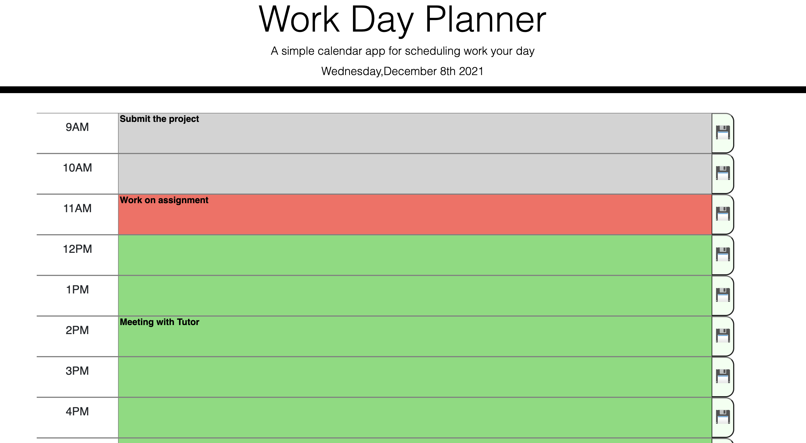
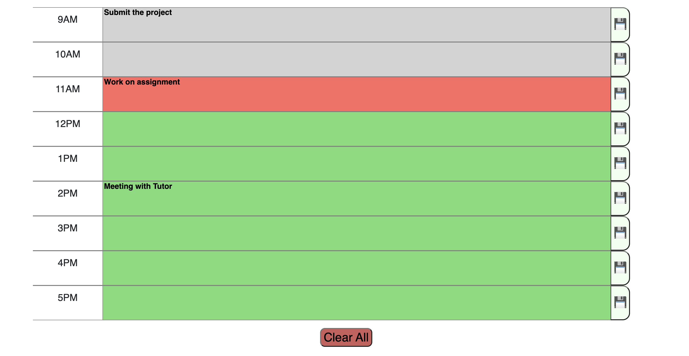

### Name of the Project: Day Planner ###

### Description: ###
Day Planner is a simple calendar application that allows the user to save events for each hour of the day. The app runs in the browser and has dynamically updated HTML and CSS powered by jQuery.

### Motivation: ###
The motivation behind this project is to learn and demonstrate HTML, CSS, Javascript, Bootstrap and jquery(Third party API's) coding skills.

### Technologies used: ###
    * HTML
    * CSS
    * Visual Studio Code Editor
    * Javascript
    * Bootstrap
    * Jquery
    * Moment.js

### Website Screen Shots: ###

### Website Contents: ###

1. The Header contains Title of the project and current date.
2. The page shows Hourly time slots in a working day(9AM to 5PM).
3. Users can add and clear the schedule.

Live deployed link:

https://sarasuni.github.io/sk-assignment-5th/

## Username:

https://github.com/sarasuni

## Email:

Sarasuni2021@gmail.com

